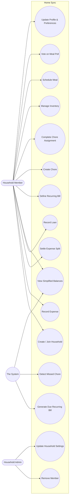

# 05 — Use Cases

## Actors

- **Household Member** — any authenticated user belonging to a household.
- **Household Admin** — a Household Member with `role = 'admin'`; a superset
  of Member (every Member use case is also available to an Admin).
- **The System** — the automated actor from
  [02-stakeholder-analysis.md](02-stakeholder-analysis.md); triggers
  use cases with no human action (debt simplification on read, missed-chore
  detection, recurring-bill generation).

## Use case diagram

Admin inherits every Member use case (not re-drawn above for legibility);
`UC5` is shown from both Member (viewing) and System (computing) because a
balance read always re-runs simplification server-side rather than reading
a stored result — see [07-process-models.md](07-process-models.md).

## Use case specifications

### UC-EXP-001 — Record Shared Expense

**Actor:** Household Member
**Preconditions:** User is authenticated and belongs to a household.
**Trigger:** User selects "Add Expense."

**Main flow:**
1. User enters amount, description, category, and payer (defaults to self).
2. User selects a split method: equal, percentage, or custom.
3. User selects which household members participate.
4. Client computes a live preview of each participant's share
   (`frontend/src/lib/splitCalculator.ts`).
5. User submits. Server independently recomputes the split
   (`backend/src/utils/splitCalculator.ts`) and validates it sums to the
   expense total.
6. System stores the expense and its splits, and appends an activity-log
   entry.
7. System returns the updated expense list; balances reflect the new debt
   on next fetch.

**Alternative flows:**
- **5a — Split doesn't sum to total** (percentage split not summing to 100,
  or custom amounts off by more than a cent): system rejects with 400
  before any row is written; no partial expense is created.
- **1a — Amount ≤ 0:** rejected by schema validation before reaching the
  controller.

**Postconditions:** Expense and its splits exist; each participant's balance
reflects their share; an activity entry exists.

---

### UC-LOAN-001 — View Simplified Household Balances

**Actor:** Household Member (read); The System (computation)
**Preconditions:** User is authenticated and belongs to a household.
**Trigger:** User opens the Loans page, or any view that fetches
`GET /api/loans/balances`.

**Main flow:**
1. System fetches all unsettled loans and all unsettled expense splits for
   the household.
2. System merges both into one net balance per member
   (`computeHouseholdBalances`).
3. System runs greedy debt simplification over the merged balances
   (`simplifyDebts`), producing the minimum set of settlements.
4. System returns both the raw per-member balances and the simplified
   settlement list.

**Postconditions:** None — this is a pure read; nothing is persisted.
Simplification is recomputed from scratch on every call rather than cached,
so it's always consistent with the latest expenses/loans.

---

### UC-CHORE-001 — Complete Chore Assignment

**Actor:** Household Member (must be the assignee)
**Preconditions:** An open assignment exists with `user_id` = caller.
**Trigger:** User marks their assignment done.

**Main flow:**
1. System checks for any of the caller's household's assignments that are
   now overdue and unhandled, applying miss-penalties first (UC-CHORE-002)
   — this runs on the read that preceded this action, not the completion
   itself.
2. User marks the assignment complete.
3. System determines whether completion is on-time (on or before
   `assigned_date`).
4. If on-time and the user's immediately-prior assignment was also on-time,
   streak continues (+1); if on-time but the prior one wasn't, streak resets
   to 1; if late, streak resets to 0.
5. System records `completed_at` and the computed `streak_count`.

**Postconditions:** Assignment marked complete; streak reflects the rule in
[06-business-rules.md](06-business-rules.md#br-chore-001--streak-continuity).

---

### UC-CHORE-002 — Detect Missed Chore (system-triggered)

**Actor:** The System
**Trigger:** Any read of `GET /api/chores` or `GET /api/chore-assignments`
for a household (lazy, not scheduled).

**Main flow:**
1. System finds assignments with `assigned_date` in the past,
   `completed_at` null, and `missed_penalty_applied = false`.
2. For each: mark `missed_penalty_applied = true` and reset `streak_count`
   to 0 (so it's never re-processed).
3. Insert a new assignment for the same chore/user dated tomorrow, flagged
   `is_penalty = true`.
4. Log an activity entry.

**Postconditions:** Missed assignment is flagged exactly once; a penalty
assignment exists; the household's activity feed shows the miss.

---

### UC-MEAL-001 — Propose and Vote on a Meal Poll

**Actor:** Household Member
**Preconditions:** User is authenticated and belongs to a household.
**Trigger:** User proposes 2–3 meal candidates for one slot.

**Main flow:**
1. User creates 2–3 `meals` rows sharing a client-generated `poll_group_id`.
2. Any household member casts one vote per candidate
   (`POST /api/meals/:id/vote`), toggling their own vote row.
3. The "winner" is computed on read as whichever candidate in the group has
   the most `meal_votes` rows — there is no separate finalize step.

**Alternative flow:**
- **2a — User votes for a second candidate in the same poll:** allowed;
  voting isn't restricted to one candidate per group in the current schema
  (`meal_votes` is unique per `meal_id`+`user_id`, not per `poll_group_id`).
  This is a known looseness — see
  [03-scope.md](03-scope.md) — not an intended "pick your favorite of many"
  design.

**Postconditions:** Vote is recorded (or removed, if toggled off); the
leading candidate is derivable from `meal_votes` counts at any time.

---

### UC-HH-001 — Join Household by Invite Code

**Actor:** Household Member (prospective)
**Preconditions:** User is authenticated and has no existing
`household_members` row.
**Trigger:** User submits an invite code.

**Main flow:**
1. System rejects if the user already belongs to a household.
2. System looks up the household by the uppercased invite code.
3. System rejects if no household matches, or if the user is somehow
   already a member of that household.
4. System inserts a `household_members` row with `role = 'member'`.

**Alternative flow:**
- **2a — Invalid code:** 404, no membership created.
- **Rate limiting:** join attempts are capped at 10 per 15 minutes per
  caller (`joinHouseholdLimiter`) regardless of outcome, to blunt
  brute-forcing the 8-character code.

**Postconditions:** User belongs to the household as a member.
