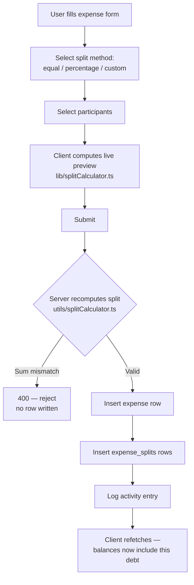
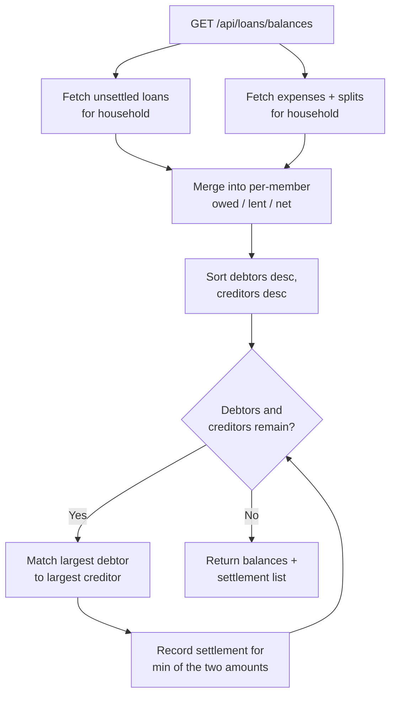
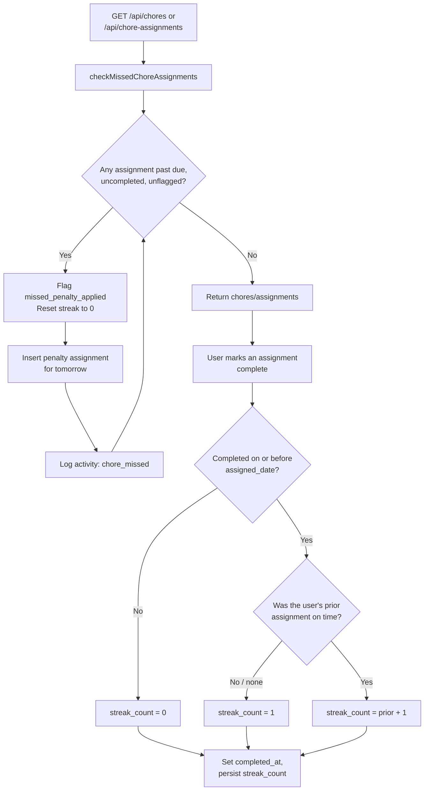
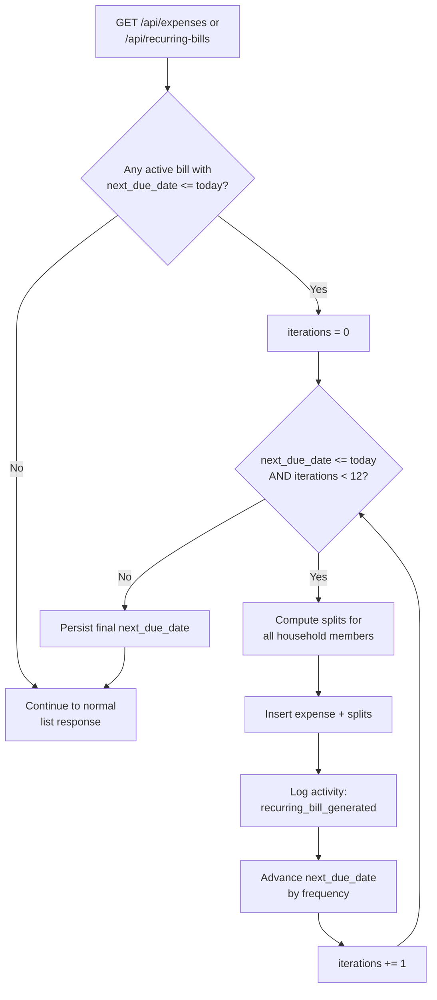
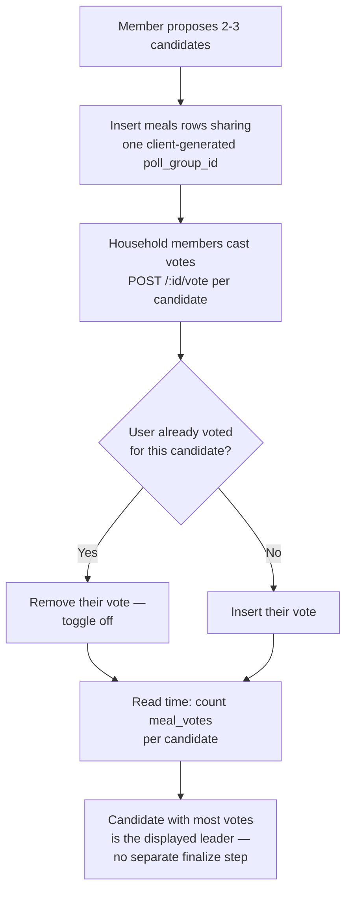
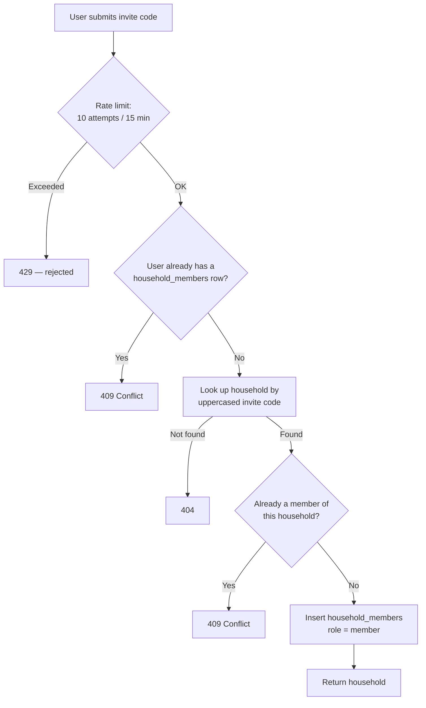

# 07 — Process Models

Each diagram reflects the actual control flow in the corresponding
controller/service, not an idealized version of it.

## Create expense

## View simplified balances (runs on every read, nothing cached)

## Complete chore assignment (with miss-detection as a precondition)

## Recurring bill generation (lazy, triggered by a read)

## Meal poll voting

## Join household by invite code

