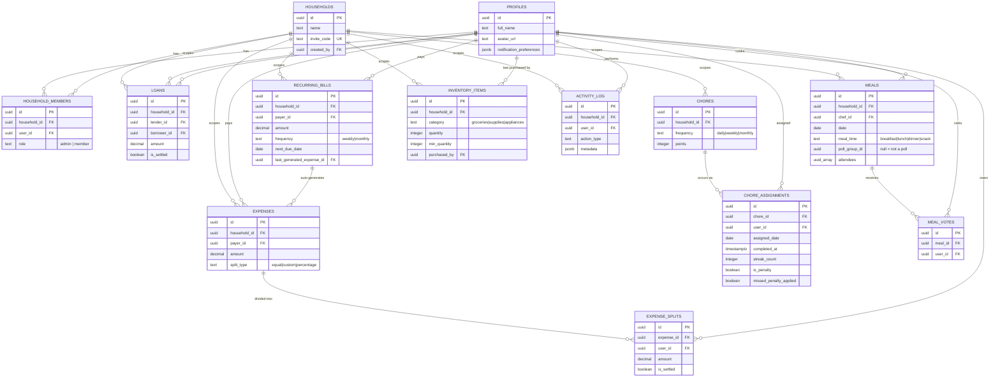

# 08 — Data Model

## Why these entities exist

Every table maps to one stakeholder concern from
[02-stakeholder-analysis.md](02-stakeholder-analysis.md) — there's no
speculative schema here for features that don't exist yet.

| Entity | Exists because... |
|---|---|
| `profiles` | Supabase Auth owns identity (`auth.users`); the app needs its own mutable row (name, avatar, preferences) alongside it, auto-created by a trigger on signup. |
| `households` | The unit everything else is scoped to. Carries its own invite code so joining doesn't require an admin to individually add each member. |
| `household_members` | The many-to-many join between users and households, carrying the one piece of authorization data (`role`) that isn't derivable from either side alone. |
| `expenses` / `expense_splits` | Separating the expense (what was paid, by whom) from its splits (who owes what share) is what makes three different split strategies possible without three different table shapes. |
| `loans` | A direct debt that isn't tied to a specific purchase — distinct from an expense split, which is why balances must merge both (see BR-EXP-004). |
| `recurring_bills` | A template, not an expense — it generates real `expenses` rows over time rather than being one itself, so a rent history is real, individually-editable expense records, not a single mutating template. |
| `chores` / `chore_assignments` | Splitting the task definition from its dated occurrences is what lets the same chore be assigned repeatedly with independent completion/streak state per occurrence. |
| `meals` / `meal_votes` | `attendees` lives directly on `meals` (a simple array) because attendance is low-cardinality per meal; voting needed its own table because a vote is per-user, per-candidate, not per-meal. |
| `inventory_items` | Flat by design — no purchase-history table, because the only need identified is "how much is left" and "who bought it last," both single columns. |
| `activity_log` | The one table every other domain writes to but nothing reads structurally — it exists purely to answer "what happened," not to drive any other logic. |

## Entity relationship diagram

## Relationships that matter beyond cardinality

- **`expense_splits` is the join between an expense and a debt, not just a
  line item.** `computeHouseholdBalances` reads it directly (`user_id`,
  `amount`, `is_settled`) as one of its two debt sources — it's a
  first-class part of the balance model, not incidental detail.
- **`recurring_bills.last_generated_expense_id` is a pointer forward in
  time, not a foreign key an expense knows about.** An `expenses` row
  generated from a bill has no back-reference to its template; the link is
  one-directional and informational only (`ON DELETE SET NULL`).
- **`meals.poll_group_id` is nullable, and null is the common case.** Most
  meals aren't polls. A poll is just N meal rows that happen to share a
  non-null value — there's no separate "poll" entity.
- **`chore_assignments` has two independent boolean flags that look
  similar but aren't:** `is_penalty` marks an assignment as having been
  *created* by the miss-detection process (a fact about its origin);
  `missed_penalty_applied` marks that an assignment has already *triggered*
  that process (a fact about its own fate). A penalty assignment can itself
  later be missed and trigger a further penalty — the two flags don't
  collapse into one.
