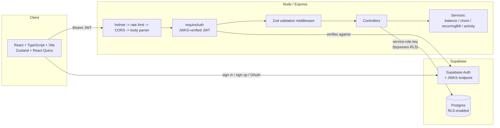

# 10 — System Architecture

## Component overview

## Why a custom backend in front of Supabase, rather than client-direct

Supabase's usual pattern is a client querying Postgres directly (anon key +
RLS as the only authorization layer). This project instead puts a Node/
Express API in front, for two reasons visible directly in the code:

1. **Business logic that doesn't belong in the client or in SQL.** Debt
   simplification, chore streaks, recurring-bill generation, and
   split-amount validation are non-trivial, stateful algorithms
   (`backend/src/services/*`, `backend/src/utils/splitCalculator.ts`).
   Implementing them as Postgres functions/triggers was considered and
   rejected in favor of TypeScript services — see the rationale recorded in
   `backend/src/services/activityService.ts`'s design comment: the acting
   user's context is already in scope in the controller, making
   human-readable activity descriptions and cross-table calculations far
   more natural in application code than plpgsql.
2. **A single authorization chokepoint.** Every request is authenticated
   once (`requireAuth`) and every household-scoped query is deliberately
   re-derived from that identity rather than trusted from the client (see
   [09-security-analysis.md](09-security-analysis.md)). Centralizing that
   in Express controllers, versus scattering equivalent logic across many
   RLS policies with subtly different edge cases, was the chosen trade-off.

The consequence: RLS still exists (see NFR-SEC-003) but is not this
project's live authorization boundary — it's a second line of defense for a
different, currently-hypothetical access path.

## Request pipeline (`backend/src/index.ts`)

Middleware order matters here and is intentional:

1. **`helmet()`** — security headers, first, before anything else runs.
2. **`globalLimiter`** — rate limiting before body parsing, so an abusive
   flood is rejected as cheaply as possible, before the cost of parsing a
   request body is paid.
3. **CORS** — origin allow-list built from `FRONTEND_URL` plus localhost for
   dev; requests with no `Origin` header (curl, mobile, server-to-server)
   are allowed through, since CORS is a browser enforcement mechanism, not
   an authentication one.
4. **`requireAuth`** (per-router) — JWT verification; attaches `req.user`.
5. **`validateBody` / `validateQuery`** (per-route) — zod schema check.
6. **Controller** — the actual handler; for read endpoints, triggers the
   lazy background services (recurring bills, missed chores) before
   returning data.

## Lazy background processing, not cron

Recurring bill generation and missed-chore detection both run inline at the
top of a relevant `GET` request rather than on a scheduled job. This was a
deliberate architectural choice: it requires no separate worker process,
no job scheduler, and no infrastructure beyond what already exists to serve
requests — at the cost of that logic only running when someone actually
looks (a household nobody opens for a month has stale `next_due_date`s
until the next visit, at which point `MAX_CATCHUP_ITERATIONS` bounds the
backfill so it doesn't become a write storm — see BR-EXP-008).

## Frontend architecture

- **React + TypeScript + Vite** — component structure mirrors the backend's
  domain boundaries (`pages/Expenses.tsx`, `pages/Chores.tsx`, etc.), one
  page per household concern.
- **React Query (`hooks/useQueries.ts`)** owns all server state — caching,
  refetch, and mutation-driven invalidation. No manual `useEffect` fetch
  loops.
- **Zustand (`store/useAuthStore.ts`)** owns client-only auth/session
  state (the Supabase client's current session, sign-in/out actions).
- **`lib/splitCalculator.ts`** deliberately duplicates the backend's split
  algorithm for a live preview — see NFR-MAINT-001 for why that's an
  accepted duplication rather than a shared package, given the project's
  current scale (two small, independently deployed apps).

## Deployment

- **Frontend:** static build, deployed via a Vercel deploy hook triggered
  from CI after `quality-control` passes (`.github/workflows/ci.yml`).
- **Backend:** deployed via a Render deploy hook, same trigger condition.
  `backend/Dockerfile` is a production image (build once, prune dev
  dependencies, run the compiled `dist/`); `backend/Dockerfile.dev` +
  `docker-compose.yml` exist purely for local development (bind-mounted
  source, `ts-node-dev`, no build step) — the two are deliberately
  different images for different jobs, not a mistakenly-duplicated
  Dockerfile.
- **Database:** Supabase-hosted Postgres; schema changes are plain SQL
  files under `supabase/migrations/`, applied via the Supabase CLI.

## CI pipeline

`.github/workflows/ci.yml` runs a single `quality-control` job — install
(`npm ci`, keyed to each package's own lockfile since this is a two-package
monorepo), typecheck, and lint, for both `backend/` and `frontend/`
independently — gating a `deploy` job that only runs on pushes to `main`
and only after `quality-control` succeeds.
